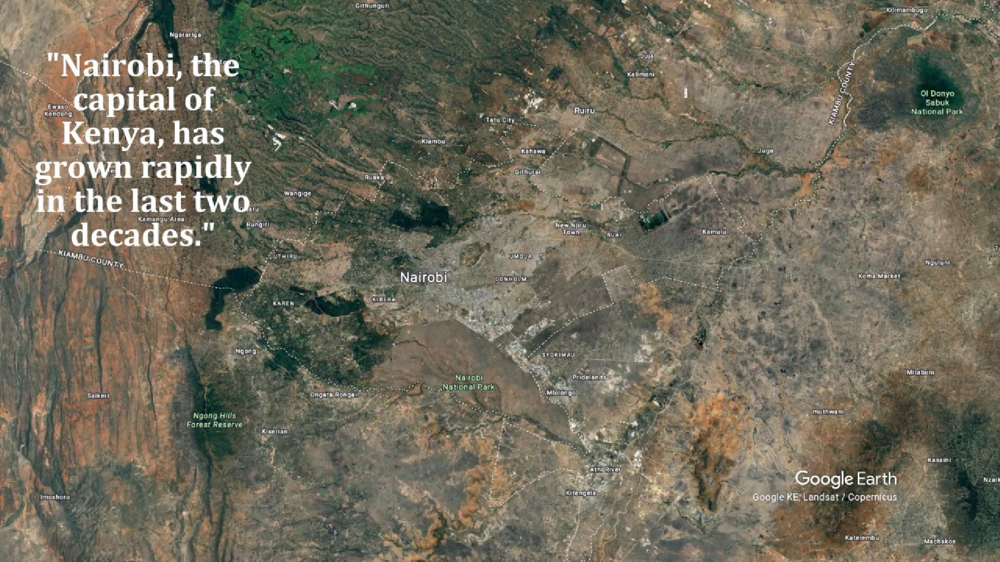

  

# Nairobi Urban Growth Visualization (2000–2024)

This project showcases Nairobi's rapid urban development using Google Earth Studio animations and population data overlays.

---

## 🎥 Video Preview

> 🔗 *Or [click here to download the final video](assets/video/zoominnairobi.mp4)*

---

## 📽️ Video Highlights
- Zoom-in to Nairobi from space
- Orbit views around the CBD
- Detailed animations of Westlands, Eastlands, and Kibera  
- Text overlays showing population changes from 2000 to 2024

---

## 📁 Folder Structure

- `assets/video/`: Rendered video clips and final export (MP4)
- `assets/images/`: Thumbnail for README and video preview
- `scripts/`: Narration script and planning
- `project-files/`: Final compiled project video or paths
- `resources/`: Data sources, credits, and license

---

## 🛠️ Tools Used
- Google Earth Studio
- CapCut (video editing)
- Canva (thumbnail design)

---

## 📊 Data Sources
- UN-Habitat
- OpenData Kenya
- World Bank

---

## 📬 Contact
For collaborations or custom animations, reach out via [costamutinda23@gmail.com]

---

## 🧾 License
MIT
